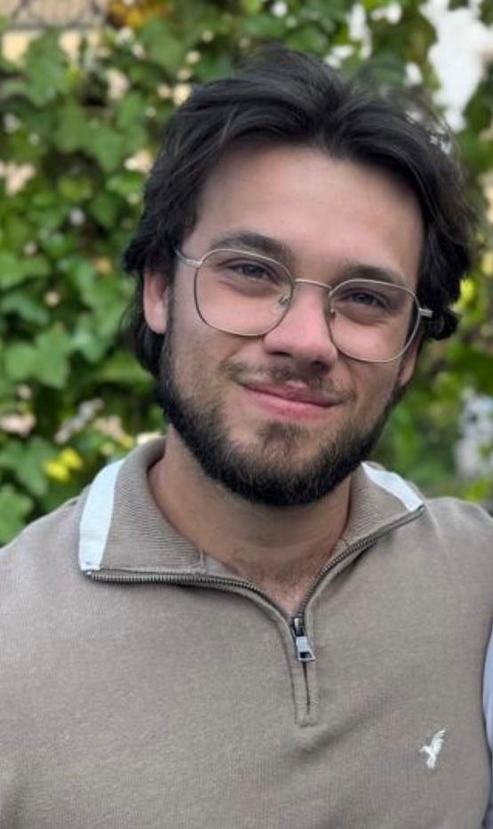

<head>
  <title>Wouter Fransen</title>
</head>

## **Home** | [Random Things](./random.md) | [Donaldson Seminar](./seminar.md)
<table>
  <tr>
    <td valign="top" width="200">
      
    </td>
    <td valign="top">
      <strong>Utrecht University</strong> 
      <a href="mailto:w.fransen@students.uu.nl">w.fransen@students.uu.nl</a>
      <h2>About Me</h2>
      

  PhD student of <a href="https://webspace.science.uu.nl/~kool0009/">Martijn Kool</a>
  with interests in enumerative geometry and related fields. Before this I was a
  master student at Utrecht University, with my master thesis titled
  "Matroidal Degenerations of Prym Varieties". Before that, I was a bachelor
  student in applied mathematics at Eindhoven University of Technology.
      

      

    </td>
  </tr>
</table>

## Writings
◦ **Master's Thesis**\
[Matroidal degenerations of Prym varieties](./Master_Thesis_Wouter_Fransen.pdf)\
Supervisor: [Olivier de Gaay Fortman](https://olivierfortman.github.io/)

◦ **Bachelor's Thesis**\
[Grothendieck Topologies on the Category of Finite Probability Spaces](./Thesis_BTW_Wouter_Fransen.pdf)\
Supervisor: [Jim Portegies](https://www.tue.nl/en/research/researchers/jim-portegies)
## Talks
◦ (Apr 2026) [Intercity Geometry Seminar](https://sites.google.com/view/lucagiove/home/intercity-seminar-on-matroids-and-hodge-conjecture): Matroids arising from families of Prym varieties

◦ (Oct 2025) [Wallcrossing seminar](https://www.uu.nl/staff/TManopulo/Extra2): Basics of geometric invariant theory in moduli problems

◦ (Feb 2024) [DutchCATS](https://dutchcats.github.io/): Grothendieck Topologies on the Categrory of Finite Probability Spaces

◦ (Nov 2023) [CASA Day](https://casa.win.tue.nl/home/event/casa-day-7/): Models for Synthetic Calculus ([Pdf](./SyntheticCalc.pdf))

◦ (2025-2026): Various talks in reading courses