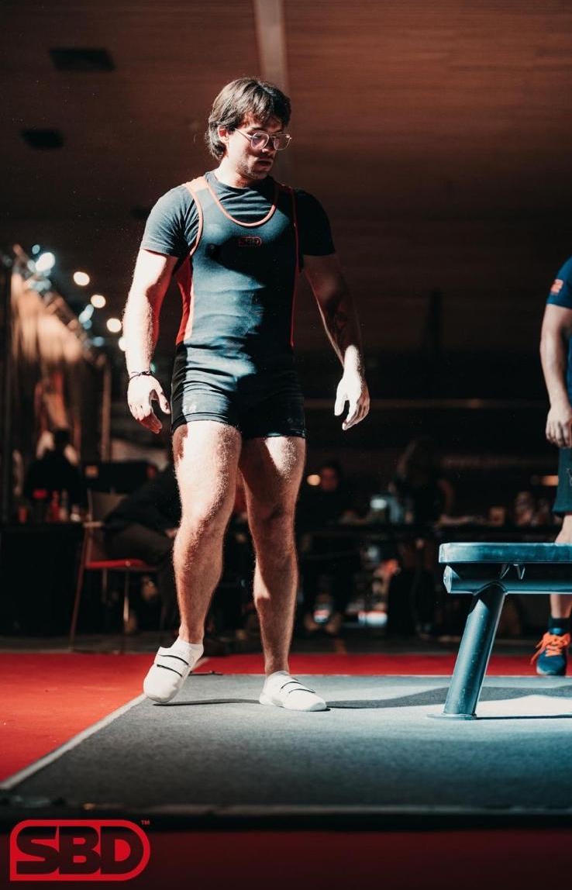

## [Home](./README.md) | **Random Things**

### Wine
*You have not appreciated wine until you have tried making it yourself*\
◦ Winegrower of a small vineyard of ~1 hectare. Grape varieties consisting of mostly Chardonnay and Pinot Meunier. \
◦ WSET Level 2 Award in Wines
### Diving
PADI Open Water Diver\
Pictures: TBA

<table>
  <tr>
    <td valign="top" width="200">
      
    </td>
    <td valign="top">
      <h2>Powerlifting</h2>
     

    I am a  powerlifter competing in the IPF: 
    ◦ Weightclass: -83kg 
    ◦ Squat: 170kg 
    ◦ Bench: 135kg 
    ◦ Deadlift: 205kg 
    ◦ <strong>Total</strong>: 510kg
    

    </td>
  </tr>
</table>
